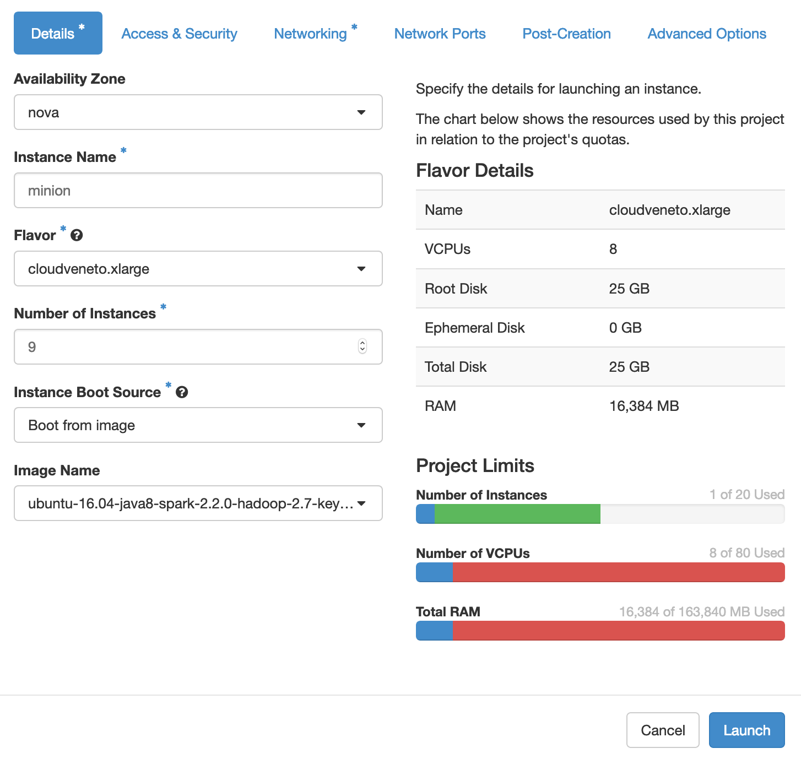
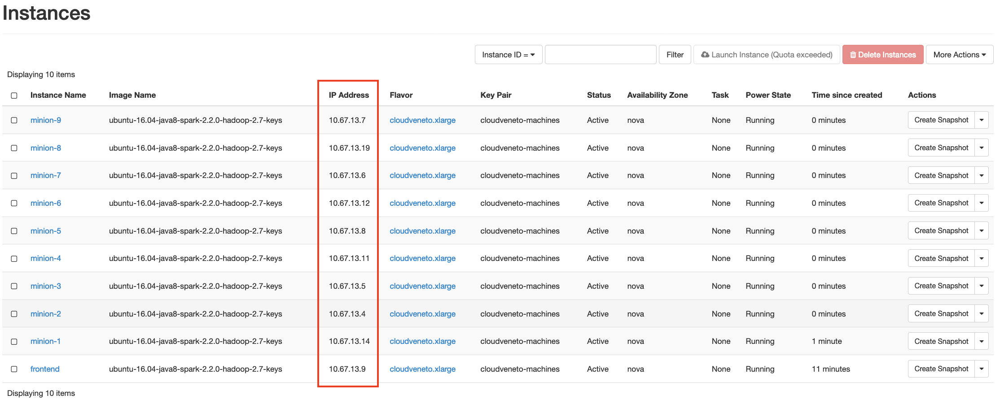
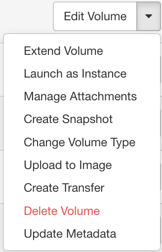
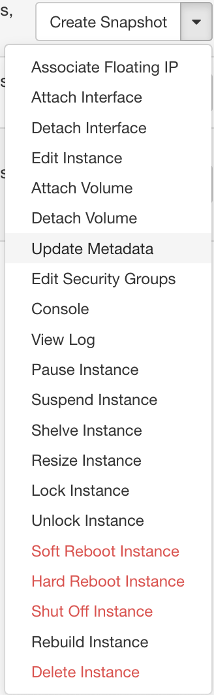

This document describes how to manage and set up the cluster for the Big Data course on CloudVeneto.

# Structure of the cluster

The cluster consists of 10 virtual machines: one machine called `frontend` and nine machines called `minion-1` to `minion-9`.
The `minion-*` machines are responsible for running the workers that execute the code of the students.
The `frontend` machine has a coordinating role: students submit their jobs to `frontend`, which then schedules them for executions using the available resources.
The `frontend` machine is the only one the students have access to.

The machines are connected with the network `10.67.13.*`.
Since the students need to have access from the outside, we the CloudVeneto admins configured for us a _public IP_ (`147.162.226.106`) which allows to log to `frontend` without going through the CloudVeneto gate.
This IP is accessible from the Unipd networks (so the internal DEI network, the internal network of the Math department, and similar) but not from the outer Internet.
Therefore if the students want to log in from home, they first need to `ssh` to `login.dei.unipd.it` (or the equivalent for their department).

# Preliminary steps

Before starting, make sure that you have the private key to access the cluster in your `~/.ssh` directory.
This key, named `cloudveneto-machines.pem`, was generated by CloudVeneto when the Big Data Computing project was created, and is needed to access the machines when they are created, before we can configure other means of logging in.
It's not clear to me how to replace it, so we should pay attention not to lose it.

The  configuration of the cluster is done with Ansible, which can be installed following [these instructions](https://docs.ansible.com/ansible/latest/installation_guide/intro_installation.html).
To use Ansible, as well as some other scripts, you will need a working Python 3 installation. To verify this, make sure that the following command succeeds:

```
python3 -V
```

As the last preliminary step, clone the git repository available at https://github.com/Cecca/big-data-course on your machine[^repository]:

```
git clone git@github.com:Cecca/big-data-course.git
```

This guide assumes a UNIX-like machine (i.e. Linux or MacOS).

[^repository]: This repository is  private on GitHub, and every user needs to be granted access.

# Setting up the cluster

This section will walk through the setup of the cluster.

## Creating the machines

The machines are created using the [dashboard](https://cloudveneto.ict.unipd.it/dashboard).
Go to the _instances_ tab, and click the _Launch instance_ button. A dialog with several options.

All machines should be created using the following setup (settings not mentioned here are to be left at the defaul values):

 - Flavor: `cloudveneto.xlarge`
 - Instance boot source: `boot from image`
 - Image name: `ubuntu-16.04-java8-spark-2.2.0`... [^1]

For the `frontend` machine, the _Instance name_ field should be set to `frontend`, for the others `minion-x` should be used, with `x` replaced by the appropriate number[^2].

[^1]: To create the image file, see Appendix \ref{sec:creating-images}. For our purposes, the already existing image should be fine.
[^2]: The minions can also be created all in one go, by changing the _Number of instances_ field in the dialog.


The dialog to launch the minion machines is shown in the following figure.
Note that here we are creating all 9 minion machines in one go: the name we set in the dialog is `minion`, then CloudVeneto will take care of appending `-i` to the name, with $i \in [1,9]$.
For the `frontend` machine the settings are the same except for the name and the number of instances.

\

After waiting a while, the machines should be set up, and you should be presented with the following screen. At this point the machines are running, they have Spark, Yarn, and HDFS installed, but they still don't know about each other. Configuring networking, among other things, will be the topic of the next section. 
Take note of the IP addresses of the machines, as reported on the dashboard.
The dashboard should present you with a situation similar to this: the red rectangle highlight the IP addresses you need to take note of.

\


Before proceeding, we need to configure networking on the CloudVeneto side.
Go to the _network_ tab of the dashboard and select _Security groups_[^security-groups].
There should be just one security group, the default one.

We will need to set several rules. For all of them, leave the defaults in the dialog except for the `port` field. The defaults are:

 - Rule: custom TCP Rule
 - direction: Ingress
 - Open Port: Port
 - Remote: CIDR
 - CIDR: 0.0.0.0/0

Then we need to create a rule for each of these ports (if they are not already present):

 - 2222 (additional ssh port)
 - 8088 (YARN web interface)
 - 18080 (Spark History server)
 - 50070 (HDFS web interface)

Now we have that the `frontend` machine running, and the security groups configured, we can associate the public IP to the `frontend` machine[^public-ip].
Click on the _Floating IPs_ tab. There should be a single IP address shown. Click on the button at the end of the line, and associate it to the `frontend` machine.

Now we are ready to test the connectivity of the machines.
First we should log into CloudVeneto's gate and then, from there, to the frontend.

```
ssh -i ~/.ssh/cloudveneto-machines.pem mceccare@gate.cloudveneto.it
ssh -i ~/.ssh/cloudveneto-machines.pem ubuntu@10.67.13.9
```

Replace `mceccare` with your username.
Do not replace `ubuntu`, instead.
That's the default user name available on the machines, we are going to use it for the administrative steps.
Note that the IP address of the frontend in the second step might be different.
You can also verify access to the other machines at this point, if you want.

Before proceding, we have to setup the frontend to accept `ssh` connections coming on the public IP on the port 2222.
Log in to `frontend` and edit the file `/etc/ssh/sshd_config`.

```
sudo vim /etc/ssh/sshd_config
```

One of the first lines is `Port 22`. Just below that line, add another one stating: `Port 2222`. This will make the `ssh` daemon listen on both ports 22 and 2222.
Save and close the file, and restart the `ssh` daemon:

```
sudo service sshd restart
```

\vspace{2em}

Finally, we need to setup the external disks of each host.
Go to the _Volumes_ tab of the dashboard and, using the _Create volume_ button create one disk of type `equallogic-unipd`, named `HDFS` of size `550Gb`.
Then, create other 9 disks named `spark-scratch-1`,..., `spark-scratch-9` of size `50Gb` each.
Once all the volumes have been created, we must attache them to the machines. To attach a volume to a machine, you have to select the drop down menu, as shown in Figure\ \ref{fig:manage-attachments}.
Attach volume HDFS to the frontend, and all other volumes to a minion each.

\begin{marginfigure}[0em]
\caption{Dropdown menu for managing volumes.\label{fig:manage-attachments}}
\includegraphics{screens/manage-attachments.png}
\end{marginfigure}
<!--  -->


[^security-groups]: Security groups act as some sort of _firewall_ for incoming connections. The defaults should be tweaked in order to make basic features work, such as SSH login without going through CloudVeneto's gate.

[^public-ip]: Normally machines on CloudVeneto are accessible just from CloudVeneto's own gate. This is very inconvenient for our setup, since it requries to have an account on CloudVeneto for each user. Using a Public IP (also called _floating IP_) allows to bypass CloudVeneto's gate.

## Configuring the machines with Ansible

Maintaining the configuration of all the machines of the cluster can be challenging.
To help with this task, we are using [Ansible](https://docs.ansible.com/), which is a tool to automate the configuration of clusters of servers.
In a nutshell, this system specifies the configuration in a series of files that describe the _desired_ state of the system.
The tool will then go through each such file, checking that each host cplies with the specification.
If not, it will update the host's state.

In our case, the configuration files are in the `ansible` directory of the repository.
To deploy the configuration on the cluster some preliminary steps are needed.

Except otherwise specified, the commands listed in this section are run from the base directory of the repository cloned in the preliminary steps.


## Setting up users for groups

Users are managed using Ansible too. 
The configuration of Ansible is automated with a script that can be run as follows.[^install-passlib]
If you want to create 30 usernames, ranging from `group01` to `group30`, the only command needed is[^usernames-file]

```
python3 ansible/create_groupsdata.py 30 >> ansible/usernames.yml
```
[^usernames-file]: \sloppy Note that the file `ansible/usernames.yml` already exists: you should _append_ the output of the above command to it, rather than overwriting.

Each user by default will have a password following the following pattern: `groupXXpwd`, where `XX` is the group's name.
Users should then change their password with the `passwd` command.

[^install-passlib]: To use the script you need the `passlib` python library installed on your machine. You can install it running the `pip3 install --user passlib` command.

## Tell the system about the IP addresses of the machines

Edit the file `frontend-public.txt`, inserting as the sole content the _public IP_ address of the frontend.
Then, edit the file `hosts.txt`, one line for each machine in the form `hostname IP`, like in the following:

```
frontend 10.67.13.9
minion-1 10.67.13.14
minion-2 10.67.13.4
minion-3 10.67.13.5
minion-4 10.67.13.11
minion-5 10.67.13.8
minion-6 10.67.13.12
minion-7 10.67.13.6
minion-8 10.67.13.19
minion-9 10.67.13.7
```

Note that for the frontend we want to use the IP of the private network of the cluster (which is the one sharing the prefix with the minions), not the public one.

The public IP of the frontend should instead be added to the `frontend-public.txt` file, which should look like the following:

```
147.162.226.106
```

At this point, run the script `gen-ssh-config.py` as follows

```
python3 gen-ssh-config.py >> ~/.ssh/config
```
\noindent
This will append to your ssh configuration file the information needed to access all the hosts directly using the frontend as a proxy.
That is, you can now run successfully

```
ssh minion-2
```
\noindent and similar commands. Log in to each and every of the machines, accepting their certificates. This is needed so not to have to accept certificates later on, when other operations are running.

\vspace{1em}
Now we need to populate the list of hosts to be used by Ansible. Simply execute the following command:

```
bash gen-hosts.sh > hosts
```

To check that everything is correctly configured, execute the following command

```
ansible -i hosts -m ping
```
\noindent
all the machines should reply `pong`, with green messages.

Now we should be all set to configure the cluster. Just run

```
ansible-playbook -i hosts -b ansible/site.yml
```

and wait (quite a long time) for the configuration to finish.

\vspace{2em}

To verify that Spark works, run the following command on `frontend`, using a user other than `ubuntu`:

```
/opt/spark/bin/run-example SparkPi 10
```

# Turning machines on and off

To turn on and off machines, go to the dashboard, select the _instances_ tab, and use the dropdown menu associated to each machine to turn them on and off, and also for rebooting.

<!--  -->

When a machine turns on, all the associated services should start as well, including Spark, Yarn, and HDFS. If they don't, consult the next section on general administration.


# General administration

This section contains instructions for some common administrative stuff.
For convenience, add the following line to your `~/.bashrc` file on the `frontend` node, so to have Yarn, HDFS and Spark commands available
```
export PATH=$PATH:/opt/hadoop/bin:/opt/spark/bin
```


## Starting Spark services

Spark-related services should start along with the machines. If they don't, run the command
```
ansible-playbook -i hosts -b ansible/spark.yml
```
\noindent
which will reconfigure the machines that are possibly misconfigured, and will start the needed services as well.

## Dealing with the distributed filesystem

Spark works best when input files are on the HDFS distributed filesystem.
In our setting we have HDFS running in a non distributed mode, for simplicity as well as for lack of resources.
A single node, the `frontend` acts as both the _namenode_[^namenode] and the single _datanode_[^datanode].
HDFS is configured automatically along with all the other services with Ansible.

Interaction with HDFS happens using the `/opt/hadoop/bin/hdfs` command. 
The following is a brief synopsis of the most useful commands available:

 - `hdfs dfs -ls`: lists files under the given path (the user's HDFS home if none is given).
 - `hdfs dfs -mkdir`: makes a new directory.
 - `hdfs dfs -put SOURCE DEST`: copies the file `SOURCE` from the local filesystem to `DEST` on HDFS.
 - `hdfs dfs -get SOURCE`: copies the file (or directory) from HDFS to the current directory on the local filesystem.
 - `hdfs dfs -chown`: changes owner of a file or directory
 - `hdfs dfs -chmod`: changes mode of a file or directory

On the cluster, we maintain the following structure for the HDFS filesystem
```
/
|-- data             # read-only inputs
|-- tmp              # temporary data
|-- shared           # system-generated information (Spark history)
|-- libs             # common libraries to all jobs, to reduce the startup time
|-- users            # for user generated data
    |-- group01
    |-- group02
    |-- group03
    |-- ....
    |-- groupXX
```

There are two directories that are of particular interest: `/data`, to which
students have read only access, and `/users/group*`, where students can write
their own data if they need.

An operation that is not necessary is the storage of the common libraries in the `/shared` directory on HDFS.
This will improve the launch time for jobs, which otherwise have to copy the libraries on the distributed file system at every run.
To copy these files, execute the following command on the fronted node:

```
hdfs dfs -ls /libs/spark-* || hdfs dfs -put /opt/spark/jars/* /libs
```

This command first checks that the files are not already present. If they are absent, it copies them from the appropriate Spark directory.

[^namenode]: Responsible of maintaining metadata for files.
[^datanode]: Responsible of maintaining the data itself, in the form of blocks.
[^shell]: For Bash, this file is `~/.bashrc`

If the node is in safemode

```
sudo -u hadoop /opt/hadoop/bin/hdfs dfsadmin -safemode leave
```

\appendix

# Creating image files
\label{sec:creating-images}

CloudVeneto offers the possibility of creating image files, that is snapshots
of the state of a machine's main disk. This allows to backup the state of the
frontend or of the minions. In particular, I created an image with Java, Spark
and Hadoop, so to simplify and speed up the creation of new machines.

To create a new image from a machine, go to the _Instances_ tab of the
CloudVeneto dashboards and click the _Create snapshot_ of the machine you want
to build the image from. After a while the image will be created. You can see
the available images in the _Images_ tab of the dashboard.
