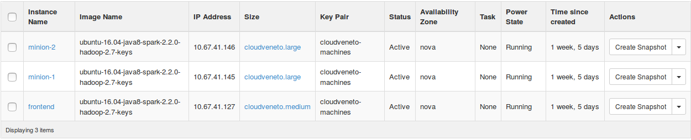

Administrator's machine setup
=============================

This page describes a convenient setup for the cluster administrator's machine.

This guide assumes a Linux machine (tested on Ubuntu 16.04). MacOS may work. Windows is not supported.

Clone the repository configuration
----------------------------------

.. todo:: describe repository cloning

Setting up the access to CloudVeneto's gate
-------------------------------------------

First of all, you will need to get access to the cloud's gate.
You should have received an email with the credentials upon registration to the cloud platform.
Suppose the username you were given is `USER`.

We are going to setup passwordless ssh authentication to the gate.

.. note::
    If you don't have a key pair, you can generate one with the :command:`ssh-keygen` utility, pressing :kbd:`Enter` to answer all questions giving the default answer.
    This will generate two files: :file:`~/.ssh/id_rsa.pub` which is your public key, and :file:`~/.ssh/id_rsa` which is your private key.

You can upload your keypair as follows.
Suppose that the public key is stored in the file `~/.ssh/id_rsa.pub`.
Run the following command

.. code-block:: shell

    ssh-copy-id -i ~/.ssh/id_rsa.pub USER@cld-blu-gate.cedc.csia.unipd.it

You will need to enter your password. 
After this you will be able to login without being asked for a password.

.. _ssh_setup:

Setting up access to cluster machines
-------------------------------------

Going through the gate explicitly is cumbersome, therefore we will setup our ssh client to go through the gate automatically.

.. todo:: link with the section about getting the cluster up and running

The figure below shows an example cluster setup with one frontend machine and two minions.

    
   An example cluster setup. Click to view the full size image.

.. todo:: check the private key on the new administrator's account

To setup passwordless authentication to each of the cluster machines you have to setup you :file:`~/.ssh/config` configuration file by adding blocks like the following::

    Host HOSTNAME
        HostName IP_ADDRESS
        User ubuntu
        IdentityFile ~/.ssh/cloudveneto-machines.pem
        ProxyCommand ssh cloud-gate -N -W %h:%p 2> /dev/null

where `HOSTNAME` and `IP_ADDRESS` match the ones of the current cluster setup.
So, considering the figure above, you :file:`~/.ssh/config` should contain::

    Host frontend
        HostName 10.67.41.127
        User ubuntu
        IdentityFile ~/.ssh/cloudveneto-machines.pem
        ProxyCommand ssh cloud-gate -N -W %h:%p 2> /dev/null

    Host minion-1
        HostName 10.67.41.145
        User ubuntu
        IdentityFile ~/.ssh/cloudveneto-machines.pem
        ProxyCommand ssh cloud-gate -N -W %h:%p 2> /dev/null

    Host minion-2
        HostName 10.67.41.146
        User ubuntu
        IdentityFile ~/.ssh/cloudveneto-machines.pem
        ProxyCommand ssh cloud-gate -N -W %h:%p 2> /dev/null

Now you can :command:`ssh frontend` directly to the frontend node.

Setting up Python and Ansible
-----------------------------

The cluster configuration is performed using `Ansible <https://docs.ansible.com/ansible/latest/index.html>`_, which is a Python tool for cluster administration.
Unfortunately, support for Python 3 is still experimental, therefore we are forced to use Python 2.7.
We want to use the latest Ansible release, and the one in Ubuntu's repository is too old.
To avoid messing with the system's python installation, we will use `Anaconda <https://www.anaconda.com/>`_, which is a python distribution with a focus on isolated environments.
Go to their `download page <https://conda.io/miniconda.html/>`_ and download the miniconda distribution with Python 2.7 for you OS.
After installation, create an environment (which is an isolated collection of Python packages) with the following command::

    conda create -n big-data-course

You then need to *activate* this environment with the following command::

    source activate big-data-course

.. warning:: 
    
   You will have to activate the environment every time you open a new terminal to start working on the course's configuration.
   You can check that you are inside the :code:`big-data-course` environment by running the following command::

       echo $CONDA_DEFAULT_ENV

   and checking if it's output is :code:`big-data-course`.

Now, we are ready to install Ansible::

    pip install ansible

Check that everything is ok by running::

    ansible --version
