Homeworks
=========

.. highlight:: java

This page describes the assignments for the homeworks.

.. _preliminaries:

Preliminaries: setup
--------------------

Before doing any work, you should setup your machine.
First of all, you need to have the Java Development Kit (JDK) version 8 installed on your machine.
If the command 

  javac -version

fails or returns something which is not along the lines of ``javac 1.8``, then head to `Oracle's download page <http://www.oracle.com/technetwork/java/javase/downloads/index.html>`_ and download the Java Development Kit **version 8**.
Version 9 has problems with Spark, so we should avoid it for the time being.
If you are using Linux, you can instal the JDK 8 with your distibution's package manager.

Then you have to download the project template available `here <https://drive.google.com/uc?export=download&id=11REd6DsiYDTwnI8uWmoBh8q7FCd9ObAB>`_.
Unpack it somewhere on your filesystem.

Then, head over to the `download page of Intellij Idea <https://www.jetbrains.com/idea/download/>`_ and install it on your system.

The following is a step-by-step guide to importing the project into Intellij and configuring it for a first run.
On the startup screen, select ``Import Project``: use the file selection dialog that pops up to select the file ``build.gradle`` file contained in the directory you downloaded.

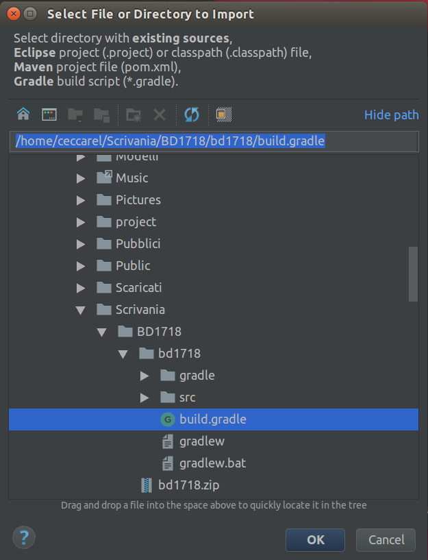

You will have to wait a couple of minutes until Intellij configures itself.
after that, use the project navigation panel on the left to open the first homework template.
If the editor looks like the following

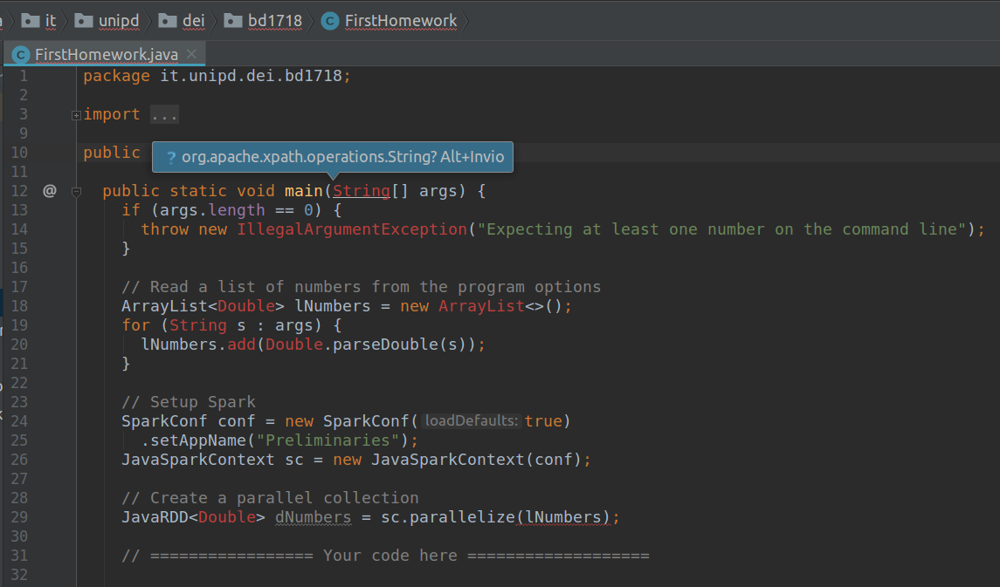

then it means that there is no Development Kit associated to the project.
To fix this problem, open the menu ``File/Project structure``.
A window like the following will pop up

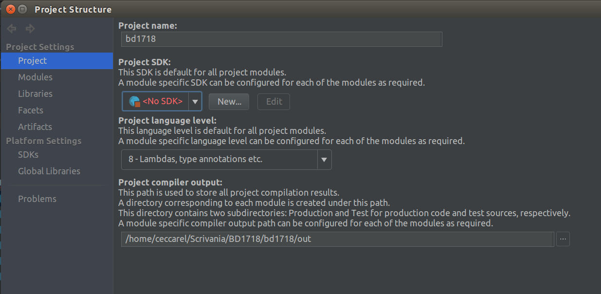

Click the ``New`` button and select ``JDK``

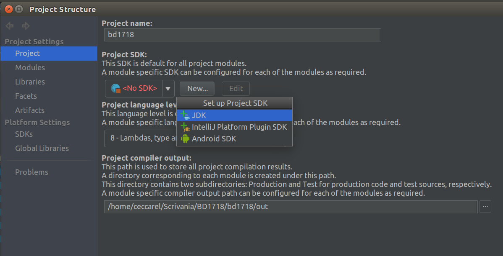

In the file selection dialog that shows up, select the JDK directory.
This is the directory containing the ``lib`` and ``bin`` folders that include Java executables and libraries.
Usually Intellij will suggest the right one.

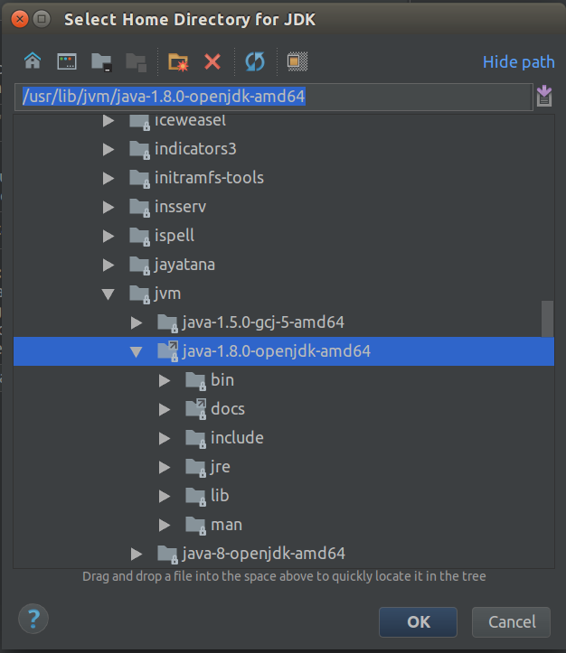

At this point all errors will disappear.
On the line of the ``main`` method there is a green arrow, which allows you to run your code.

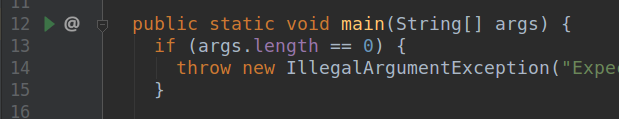

Clicking the green arrow will compile the code and run it.
The first time you try to run it will result in an error, since the program expects to receive a file name on the command line.
To configure the parameters with which the program is run, use the drop down menu shown below

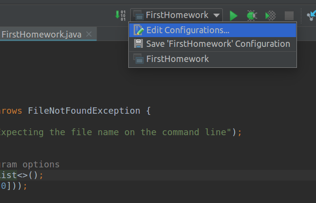

This will open the following dialog

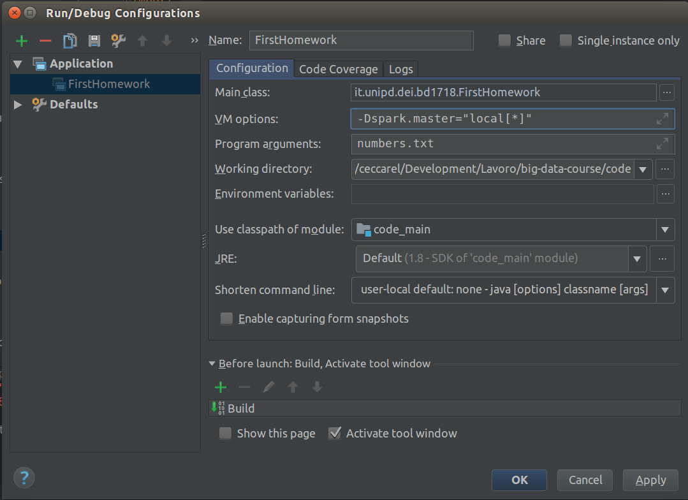

On the ``program arguments`` box you can set the arguments that are passed to the ``main`` method.
You should also set the value of ``VM Options`` as shown in the figure.
As you will see in the second homework, Spark can run both locally on your machine or on a cluster.
Which of the two configurations is used is determined by the ``spark.master`` `java system property <http://www.java2s.com/Tutorial/Java/0120__Development/SettingtheValueofaSystemPropertyfromtheCommandLineaddDoptiontothejavacommandwhenrunningyourprogram.htm>`_.

.. note:: A note for Python users

  Spark also exposes a Python interface. To use Spark from Python on your local machine, the simplest way is to install the ``pyspark`` package with the command::

    pip install pyspark

  Then in your Python script it's sufficient to add the following statement on top of the file::

    import pyspark

  You can find more about Spark's Python API `here <https://spark.apache.org/docs/latest/api/python/>`_.

--------------------------------------------------------------------------------

Homework 1: functional programming
----------------------------------

The purpose of this first homework is to get acquainted with the principles of *functional programming*, on which MapReduce and Spark are based.
One of the core ideas of functional programming is that functions can be arguments to other functions.
For instance, a sorting algorithm may take as a parameter the comparison function along with the data to be sorted.

Java 8 introduced support for this style of programming by adding new syntax for specifying so-called *anonymous functions*, also called *lambdas*.
This syntax allows to write functions directly in the argument list of other functions.
The syntax for specifying a function is the following::

  (T1 param1, T2 param2, ...) -> {
    // Body of the function
    // with as many statements as you need
    // separated by semicolons, just like regular
    // Java statements.
    return /* possibly something */;
  }

Where ``T1``, and ``T2`` are the types of ``param1`` and ``param2``, respectively.

If the function is made by a single statement, a more concise syntax can be used::

  (T1 param1, T2 param2) -> /* single statement with no semicolon */

the result of the single statement will be the return value of the function.

If the type of the parameters can be inferred from the context, it can be omitted.

An example will make things clearer.
Imagine you have a collection ``coll`` of ``Double`` with a method ``map`` (more on such collections later).
The ``map`` method transforms the collection in a new one by applying the a function, passed as a parameter, to each element.
Therefore, to obtain a a collection of the squared values you should do the following::

  coll.map((Double x) -> x*x);

Since the collection is of ``Double``, the compiler can infer the type of ``x``, so in this case we can write::

  coll.map((x) -> x*x);

To make another example, imagine that you want to transform your collection of ``Double`` into a collection of differences from some other value, defined in a variable::

  double fixed = 1.5;

  coll.map((x) -> {
    double diff = fixed - x;
    return diff;
  });

Note that ``fixed`` is used in the body of the anonymous function, but is defined outside of it!
In such cases we say that the anonymous function *captures* a variable.
You cannot re-assign a captured variable within an anonymous function.
Trying to do it will result in a compilation error mentioning that all captured variables must be *effectively final*, which is the compiler's way of saying that you cannot re-assign them.

Java 8 also introduced another way of passing functions to other functions, namely *method references*.
Suppose you have the following class::

  public class Operations {

    public static double square(double x, double y) {
      return x * y;
    }
  }

You may which to pass the *static* method ``square`` to the method ``map`` instead of defining a lambda function, like in the examples above.
The syntax to refer the the static method ``square`` is the following::

  coll.map(Operations::square);

note the double colon joining the method name ``square`` to the class it belongs to, ``Operations``.

Therefore, you have two ways of passing a function to a method: either you pass an anonymous function or a method reference.
Usually, lambda functions are used when the functionality can be coded in a few statements and is limited to a single occurrence.
Method references, on the other hand, are useful when the code gets more complex or when it should be reused in several places.

So far, we have assumed the existence of a collection type providing a ``map`` method accepting a function as an argument.
There are several types of collections providing such a method (including many from the Java Standard Library).
However, since these homeworks are about Spark, we will focus on collections provided by Spark, namely *Resilient Distributed Datasets* (RDD for short).
An RDD is a collection of elements that can be possibly partitioned across many machines and on which operations execute in parallel.
In the Spark Java API, the class defining the RDD data structure is ``JavaRDD`` (`API link <https://spark.apache.org/docs/latest/api/java/org/apache/spark/api/java/JavaRDD.html>`_).

The peculiarity of the RDD data structure is that it does not allow in-place updates.
The only way to modify the contents of an RDD is to *transform* it in another collection by means of some method.
Some methods to transform an RDD into another are the following:

* ``map``: yields another RDD by applying the supplied function on each element
* ``filter``: returns an RDD containing only the elements for which the given boolean function returns ``true``.

There are also functions to get a single value which is the result of some operation on the entire collection, which are called *actions*:

* ``count``: returns the number of elements of the RDD
* ``collect``: store all the data of the RDD in a local ``List``.
* ``reduce``: returns the result of *reducing* the collection with the given commutative and associative function. Conceptually, this operation is equivalent to applying the function to the first two elements of the collections, then to the result and the third, then to the result and the fourth and so on, until there are no more values.
  No assumptions on the order of applications can be made, which is why the function needs to be associative and commutative. The following picture depicts an example for the addition function on the list ``47 11 42 13``

  .. image:: https://i.stack.imgur.com/OCsJC.png

These are not all the methods available to transform and collect data in Spark: an overview of the most useful methods and types is given :ref:`here <spark-api>`.

Note that the methods of ``JavaRDD`` that we saw are all functional in nature (well, except ``count`` and ``collect``): they accept another function as a parameter to know what to do with elements.

.. sidebar:: Variable names

  In the example code we will tend to use variable names with one-letter prefixes to distinguish variables representing local data and distributed data (that is, RDD data). Local data will be prefixed by ``l`` (e.g. ``lName``) and distributed data by ``d`` (e.g. ``dName``).

Now, open the file ``src/main/java/it/unipd/dei/bd1718/FirstHomeworkTemplate.java`` in the project template.
It contains some setup code (most of which will be explained in the next homework) and a section where you can put your code.
The setup code reads a sequence of ``double`` values from the command line (see the video in the :ref:`preliminaries <preliminaries>` section to see how to configure command line arguments in Intellij IDEA) and turns them into a ``JavaRDD`` named ``dNumbers``.

We will develop some code that computes the sum of squares of the elements of ``lNumbers``. You can use this code as a starting point for this homework's assignment.

.. code-block:: java

  // Compute the square of each number, obtaining a new JavaRDD
  JavaRDD<Double> dSquares = dNumbers.map((x) -> x*x);
  // Reduce dSquares to a single number
  double sumOfSquares = dSquares.reduce((x, y) -> x + y);

  System.out.println("The sum of squares is: " + sumOfSquares);

Exercises
^^^^^^^^^

Explore Spark's API by coding variations of the examples we made above.
Here are some examples: 

1. Given ``dNumbers``, compute the absolute value of the difference between each element and the mean of all the values.

2. Given ``dNumbers``, compute the minimum of all the inverse values. Do it in at least two ways (e.g. using ``map`` and ``reduce``, and using the ``min`` method with an anonymous function implementing a custom comparator. The ``min`` operator has some caveats, have a look :ref:`here <spark-api>`).

Come up with a third task. You can use whichever methods of ``JavaRDD`` you want.

--------------------------------------------------------------------------------

Intermission: RDDs, executors, and parallelism
----------------------------------------------

Before proceeding to homework 2, some words about Resilient Distributed Datasets, Spark's basic data abstraction, are in oder.

A Resilient Distributed Dataset (RDD for short) is a collection of elements of the same type, possibly distributed across many machines.
As we have briefly discussed in the previous homework, a RDD cannot be modified in place.
Instead, new RDDs are created by means of *transformations*: we provide a function, and Spark applies it to the elements of the RDD, yielding another RDD with the resulting values.
An RDD is partitioned in a configurable number of *blocks*, each of which contains several elements.
The blocks can be distributed across many machines.

Each machine is called an *executor* in Spark, and usually has many cores.
When transforming an RDD, we have a function to be applied to all the elements of the RDD.
In Spark, a *task* is a pair formed by a function and a block of a RDD.
Therefore, when transforming an RDD, we have as many tasks as RDD blocks.
Each core of each executor will take a task and execute it: the function will be applied *sequentially* to each element of the given RDD block.
Therefore, parallelism arises from the fact that the RDDs are partitioned in many blocks, and each block can be processed independently.
Furthermore, note that the number of blocks and the total number of cores may be different:

* you may have more cores than blocks, in which case there are not enough tasks and some cores will sit idle
* you can have exactly as many blocks as cores. Each core usually executes a single task. This actually depends on the scheduler, which may opt to make some cores execute more than one task and leave some others with no work.
* you can have more blocks than cores, in which case some tasks will wait for others to finish.

Setting the number of blocks depends on the application. Sometimes having many more blocks than cores helps with load balancing: cores completing tasks faster (possibly because of the characteristics of the data they are processing)  will have more tasks to work on.

--------------------------------------------------------------------------------

Homework 2: Spark basics
------------------------

In this second homework, we will see how to use Spark more in detail, using the classic word count task as a running example.

Setting things up: the Spark context
^^^^^^^^^^^^^^^^^^^^^^^^^^^^^^^^^^^^

The entry point to Spark is the Spark context. 
Since Spark can run on your laptop and on many different cluster architectures, to simplify the user experience Spark developers have created a single entry point that handles all the gory details behind the scenes.
In the Java API, the relevant class is ``JavaSparkContext``.
To instantiate such a class, you need to provide some configuration using the class ``SparkConf``::

  SparkConf configuration = 
    new SparkConf(true)
      .setAppName("application name here")
      .setMaster("<master>");

Let's break down the code snippet above.
On line 2, we pass ``true`` to the ``SparkConf`` constructor.
The effect is that configuration properties will be read from system properties (i.e., the ones passed on the command line after the ``java`` command using the ``-Dproperty.name=property-value`` sintax).
Line 3 sets the name of your application. Note that this line and the following one are method invocations on the ``SparkConf`` object being created.
Finally, line 4 sets the address of the master.
As detailed in the `Spark documentation <https://spark.apache.org/docs/latest/submitting-applications.html#master-urls>`_, there are several values that this string can take.
For this course, two are interesting.

* ``"local[*]"``: use the local resources of the computer. This sets up a Spark process on the local machine, using the available cores for parallelism.
  Use this setting when testing code on your local machine.
* ``"yarn"``: run Spark on the Yarn cluster manager. This is the cluster manager used by the cloud computing platform available for the course. Use this setting when running on it.

There is also the possibility of not setting the master in the ``SparkConf`` object. 
In this case, you should specify the Spark master either using the Java property ``spark.master`` on the command line (for instance when running locally on your laptop), or by specifying the ``--master`` option of the ``spark-submit`` command (:ref:`documentation <spark-submit>`).
By not hardcoding the master configuration in you code, you have the flexibility of running on different architectures.
If you are using the Intellij Idea IDE, you can configure the Spark master using the configuration dialog that can be accessed from ``Run -> Edit configurations``, as shown in the following figure, where the relevant configuration is ``VM options``.

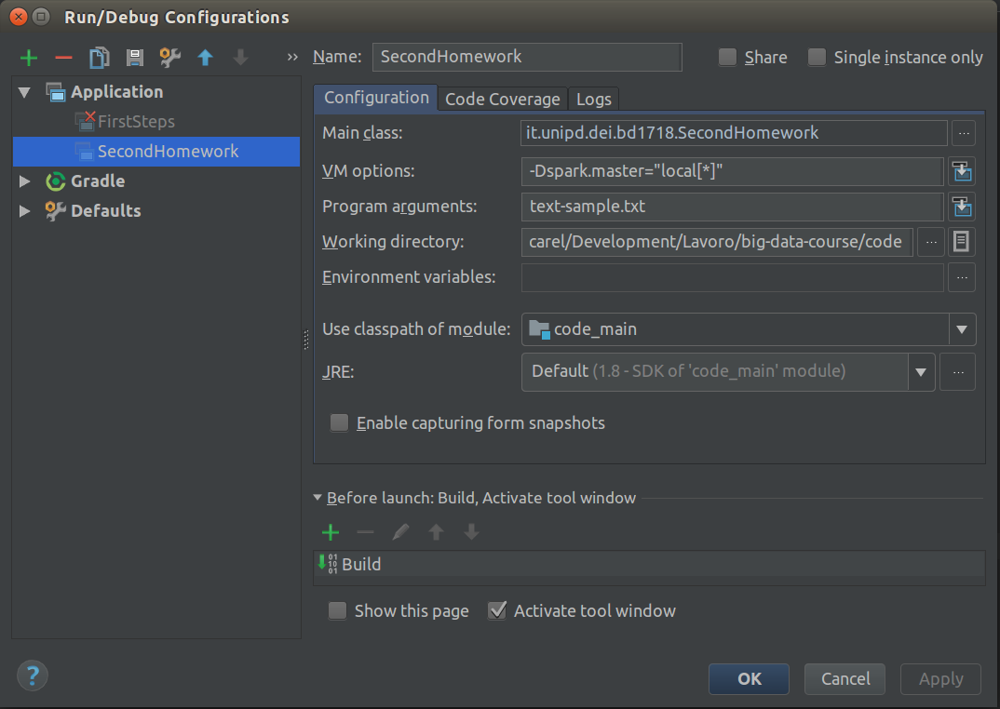

A run configuration is created for you the first time you try to run a main method by clicking on the green arrow beside the line of the main method itself.

Once you have created a ``SparkConf`` object, you can instantiate a ``JavaSparkContext`` as simply as::

  JavaSparkContext sc = new JavaSparkContext(configuration);

Now we are ready to use this Spark context to load data.

Loading data from text files
^^^^^^^^^^^^^^^^^^^^^^^^^^^^

In the first homework, we built a RDD by calling ``sc.parallelize`` on an existing collection.
However, usually data is stored in one or more files, in a variety of formats.
The simplest format is plaintext, we we will now see how to load text files into Spark.
Download the sample file `text-sample.txt <https://drive.google.com/uc?export=download&id=1DWSGmHHepOfAUznj5KrfU9q4kg-tlslY>`_ and place it in the root directory of your code.

The following line of code loads the text file into an RDD with an element for each line::

  JavaRDD<String> lines = sc.textFile("text-sample.txt");

If you open the file you will see that it looks quite strange. Here are the first three lines::

  Follyfoot Follyfoot be a child television series co-produce by the majority-partner british television company Yorkshire Television for transmission on itv and the independe...
  Golden line the golden line be a type of Latin dactylic hexameter frequently mention in Latin classroom in English speak country and in contemporary scholarship write in Eng...
  Chris Isaak Christopher Joseph Isaak bear June be a american rock musician and occasional actor he be best know for he hit wicked game as well as the popular hit song Baby...

This file has been obtained by sampling 1000 documents from a recent dump of Wikipedia.
The text of each page has been `lemmatized <https://en.wikipedia.org/wiki/Lemmatisation>`_. Lemmatization is a common preprocessing step when dealing with text documents.
Using Natural Language Processing techniques, each word is reduced to a *lemma*: plurals are turned to singluar, verbs are turned to infinity, etc...

In this homework, in which we are counting word occurrences, it is useful to have a lemmatized dataset: this way we count variations of the same lemma correctly.
    

.. topic:: Profiling

  When writing code, one often wonders how much time the program is taking, and where the time is spent.
  In sequential programs, measuring time is as simple as calling ``System.currentTimeMillis()`` in the relevant spots.
  In Spark programs, however, there are some issues with this approach.
  Spark transformations are *lazy*, in the sense that they don't happen right away, when a transformation method is called. 
  Instead, Spark remembers that it has to transform the data with the given function.
  The transformation will be actually executed only once an action (such as counting the elements or writing them to a file) requires the transformed data.
  This allow Spark to run more efficiently, however it makes measuring time more difficult.
  Suppose we want to take the time it takes to count the words of :file:`text-sample.txt` using the methods we will see in the next section.
  If we were to do like the following::

    JavaRDD<String> docs = sc.textFile("text-sample.txt");
    long start = System.currentTimeMillis();

    // Code of which we want to measure the running time

    long end = System.currentTimeMillis();
    System.out.println("Elapsed time " + (end - start) + " ms");

  then we would be measuring also the time to load the text file!
  In fact, ``sc.textFile`` is not executed immediately, rather it is executed when an action requires it, *after* we start our stopwatch.
  Therefore, we need to *force* the file loading before we start the stopwatch.
  In order to do so, we have to run an action on the ``docs`` RDD, and the simplest one is ``count``.
  However, simply invoking ``count`` would not do: we have to explicitly tell Spark to cache the results in memory::

    JavaRDD<String> docs = sc.textFile("text-sample.txt").cache();
    docs.count();

    // Now the RDD has been loaded and cached in memory and
    // we can start measuring time
    long start = System.currentTimeMillis();

    // Code of which we want to measure the running time

    long end = System.currentTimeMillis();
    System.out.println("Elapsed time " + (end - start) + " ms");

  The above strategy is good to take the overall running time of a section of the program, but is inadequate for finer grained profiling.
  To see how much time your Spark program spends running each transformation and action, you can use the web interface that is built-in into Spark.
  This interface runs alongside your program, and exits when the program terminates.
  In order to have time to consult it, we have to suspend the execution of the program.
  The simplest way is by inserting an input statement right before the end of your ``main`` method::

    System.out.println("Press enter to finish");
    System.in.read();

  Now, after starting your program, open a browser and visit `<localhost:4040>`_.
  You will see the web interface of your running program, which you are invited to explore.
  In the fourth homework (where we will run software on the cloud) we will see an alternative way of accessing the web interface after your program has terminated, allowing you to get rid of the ``System.in.read()`` call. 

Counting words
^^^^^^^^^^^^^^

A classic MapReduce example is word count.
Given a set of documents, we want to count the number of occurences of each word across all the document corpus.
We will see several ways to implement it in Spark.
Each implementation will assume that we have a ``docs`` collection of type ``JavaRDD`` where each line is a sequence of space-separated words prepresenting a document.
Such a dataset can be obtained from the :file:`text-sample.txt` file with::

  JavaRDD<String> docs = sc.textFile("text-sample.txt");

First of all, let's look at the classic MapReduce algorithm for word counting::

  Map<String, Long> count = docs
    .flatMapToPair((document) -> {             // <-- Map phase
      String[] tokens = document.split(" ");
      ArrayList<Tuple2<String, Long>> pairs = new ArrayList<>();
      for (String token : tokens) {
        pairs.add(new Tuple2<>(token, 1L));
      }
      return pairs.iterator();
    })
    .groupByKey()                       // <-- Reduce phase
    .mapValues((it) -> {
      long sum = 0;
      for (long c : it) {
        sum += c;
      }
      return sum;
    })
    .collectAsMap();    // <-- Collection of the result

The map function is implemented with a ``flatMapToPair`` call.
We use a ``flatMapToPair`` operation for two reasons.
The first is that we have to generate a dataset of key-value pairs, the second is tat from a single value (a document represented as a single string), we have to generate several key-value pairs.
The map function first splits the document at spaces then iterates over the tokens, creating a new pair for each one of them.
The pairs are accumulated in an ArrayList, which we then return as an iterator.

For the reduce phase, we have to use a chain of two functions.
First, with a ``groupByKey`` operation we collect the values (that is the counts) associated to the same key (which is a word) into a list.
Then, with a ``mapValues`` operation we can apply a function to all the values associated to a key.
The function we apply simply accumulates all the counts into a ``sum`` variables, which is then returned as the result.

This implementation takes **6073 milliseconds** on average, on my machine using 4 cores.

Observe that this implementation is missing the opportunity of some optimizations.
Most likely there are several words that occur more than once in a single document.
As of now, we are creating a key-value pair with value ``1L`` for each occurrence of repeating words.
What if we accumulate counts of repeated occurences during the map phase instead?

Try to change the function passed to ``flatMapToPair`` to the following::

    (document) -> {
      String[] tokens = document.split(" ");
      HashMap<String, Long> counts = new HashMap<>();
      ArrayList<Tuple2<String, Long>> pairs = new ArrayList<>();
      for (String token : tokens) {
        counts.put(token, 1L + counts.getOrDefault(token, 0L));
      }
      for (Map.Entry<String, Long> e : counts.entrySet()) {
        pairs.add(new Tuple2<>(e.getKey(), e.getValue()));
      }
      return pairs.iterator();
    }

You should see an improvement in the running time.
On my machine, this version takes **4390.2 milliseconds** on average.
This improvement is due to the fact that we are doing *document-level* aggregation, that is, we are aggregating some data before information is exchanged between processors, thus reducing the amount of data exchanged.

We can bring this concept a step further.
Recall that a RDD is a collection of data partitioned across many processors, potentially located on different machines.
Each partition will contain several elements, documents in this case, and will be processed in one go by a single processor.
So, instead of doing document-level aggregation, we could do partition-level aggregation.
This is the purpose of the ``reduceByKey`` operation.
The name is slightly misleading, since it's not really equivalent to the standard definition of a reduce operation in MapReduce.
The standard reduce of MapReduce can operate on all the values associated with a key, and is implemented with a ``groupByKey`` in Spark, as we have seen.
A ``reduceByKey``, instead, applies a user-provided function to pairs of elements sharing the same key, until there is just one element per key.
There is no guarantee on the order of application, therefore the function being applyed **must** be commutative and associative.
By accepting this restriction, you allow Spark to aggregate data at a partition level, resulting in even less communication between processors and therefore in more performant code.
The implementation of word count with ``reduceByKey`` is the following::

  Map<String, Long> count = docs
    .flatMapToPair((document) -> {   // <-- map phase
      String[] tokens = document.split(" ");
      HashMap<String, Long> counts = new HashMap<>();
      ArrayList<Tuple2<String, Long>> pairs = new ArrayList<>();
      for (String token : tokens) {
        counts.put(token, 1L + counts.getOrDefault(token, 0L));
      }
      for (Map.Entry<String, Long> e : counts.entrySet()) {
        pairs.add(new Tuple2<>(e.getKey(), e.getValue()));
      }
      return pairs.iterator();
    })
    .reduceByKey((x, y) -> x + y)   // <-- reduce phase
    .collectAsMap();

On my machine, using 4 cores, this implementation takes **3641.2 milliseconds** on average.

The plot below compares the running times of the three implementations we have seen so far, with confidence bars.

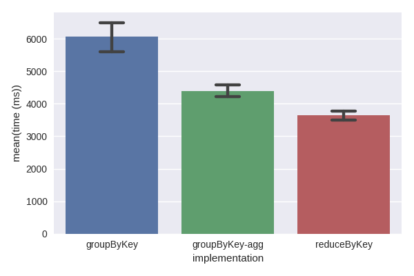

Each bar corresponds to a different implementation:

1. ``gropuByKey`` is the first implementation we looked at.
2. ``groupByKey-agg`` is the second implementation, with document-level aggregation.
3. ``reduceByKey`` is the last implementation, doing partition-level aggregation.

Exercises
^^^^^^^^^

1. Compute an histogram of word lengths: the number of words of length 1, 2, 3, and so on...

------------------------------------------------------------------------------

Third Homework
--------------

The task of the third homework is to implement the sequential k-center algorithm by Gonzalez.
Points to be clustered are represented by instances of the class ``org.apache.spark.mllib.linalg.Vector``.
You can download three example datasets:

* `vecs-50-10000.bin <https://drive.google.com/uc?export=download&id=1b6G-Y7va7Lq7ikek5XoWEquy3hu51fl7>`_ 10 thousands vectors in 50 dimensions
* `vecs-50-50000.bin <https://drive.google.com/uc?export=download&id=1XZSi5jnijkwcXzhTkPS1cwyp-EN5-Ars>`_ 50 thousands vectors in 50 dimensions
* `vecs-50-100000.bin <https://drive.google.com/uc?export=download&id=15KHSg7J8W0qWzw1d9RTwjGejceVrwiCi>`_ 100 thousands vectors in 50 dimensions

These datasets are in binary format and should be read using the ``InputOutput.readVectors`` method provided within the project's template.

.. warning::
  There is also a ``org.apache.spark.ml.linalg.Vector`` class within Spark.
  They are functionally equivalent, but incompatible with one another.
  This unfortunate difference is due to the history of Spark's   API.
  For the homeworks we will use classes from the ``org.apache.spark.mllib`` package.

You have to develop a function that accepts a ``java.util.ArrayList`` of ``Vector`` objects and an integer ``k``, and returns the ``java.util.ArrayList`` of cluster centers (as ``Vector`` objects).
We will use the Euclidean distance between vectors, which is already implemented in the static method ``sqdist`` of the class ``org.apache.spark.mllib.linalg.Vectors``::

  Vector a, b;
  double dist = Vectors.sqdist(a, b);

For your convenience, the homework template already contains a ``main`` method that takes two command line arguments, namely the path to the input and the integer ``k``, and runs your implementation of the algorithm.
It also measures the elapsed time, appending it to a file named ``k-center-time.txt``.

Exercises
^^^^^^^^^

1. After implementing k-center, verify that it runs linearly in both ``k`` and ``n``. You can use the file ``k-center-time.txt`` for this purpose.

------------------------------------------------------------------------------

Fourth Homework
---------------

This homework's task is to solve the diversity maximization problem you have seen in class.
The homework template provides the implementation of the sequential approximation algorithm for diversity maximization, along with a method to compute the diversity of a given set.
Furthermore, there is a ``main`` method which takes care of reading command line arguments, loading input, and so on.
The ``main`` method also allows you to select which algorithm to run on the input: if the sequential one, a random sampling or your MapReduce implementation.

You are required to implement two methods.
The first method, ``runRandom``, should take a RDD of vectors and return a random sample of size ``k``, to serve as a baseline.
The second method, ``runMapReduce``, takes as input a RDD of vectors, the parameter ``k``, and the number of blocks on which to apply the k-center algorithm you developed in the third homework.
You can group by random keys using a combination of the ``groupBy`` key method of the ``JavaRDD`` class, and the ``java.util.Random.nextInt(int)`` method.

For the purpose of testing your implementation on your laptop, you can use the sample of vectors provided for the previous homework.
For this homework, you should also run your code on the cluster.
To pack your code in a jar file suitable to be uploaded on the cluster, you can follow the steps below.

First, open the ``gradle`` panel by hovering over the menu in the bottom-left corner

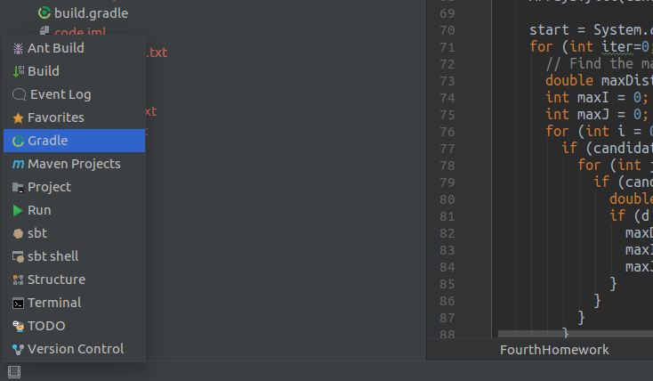

Then run the ``shadowjar`` task, which will create a jar file containing all your code and its dependencies in the directory ``build/libs``

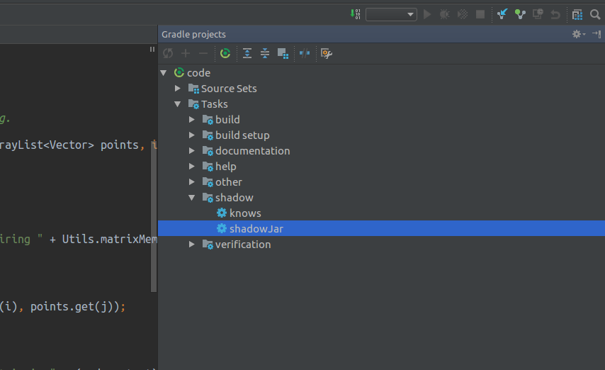

Then, to upload the jar file to your account on the cluster, open the embedded terminal, again by hovering over the bottom-left button.

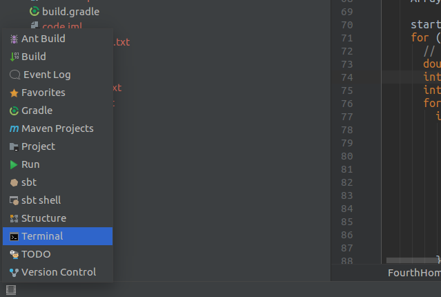

The terminal will open in the root directory of the project.
Run the scp command as shown in the image below, changing ``group01`` to your group's ID, and possibly changing the name of the jar file.

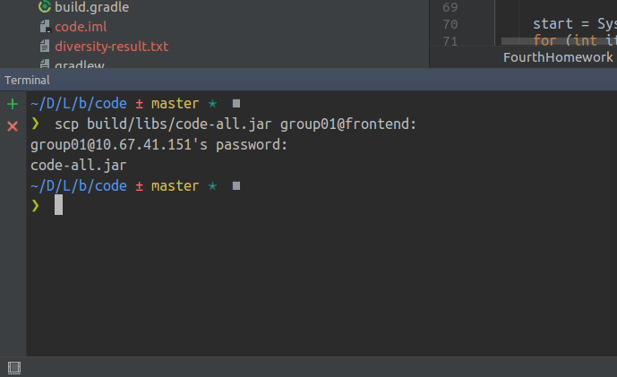

If you are on windows, replace ``scp`` with ``pscp``, and use ``\`` instead of ``/`` in file paths.
On all operating systems, don't worry if you don't see characters appearing on screen while you type your password: it's the expected behaviour to preserve your privacy.

Now you can login to the ``frontend`` and run your code using the ``spark-submit``, which is described :ref:`here <spark-submit>`.
Data on the cluster is hosted in `HDFS <https://www.ibm.com/analytics/hadoop/hdfs>`_, which stands for Hadoop Distributed Filesystem.
Just like the filesystems you are used to, HDFS is organized in files and directories.
Therefore, on the cluster there are two co-existing file hierarchies: the Operating System one, which is used during normal operation, and HDFS, which stores data to be used as input for Spark jobs.
To interact with HDFS there is a dedicated command, unsurprisingly called ``hdfs``, whose synopsis is given :ref:`here <hdfs-command>`.
In particular, there is directory named ``/data`` in HDFS which contains read-only copies of datasets that you can use to test your code.
To get a list of the available datasets you can use the following command::

  hdfs dfs -ls /data

All datasets available under ``/data`` are made of ``Vector`` instances, with each vector having the number of dimensions specified by the first number its name. The second number is the number of vectors in the dataset.
So, for instance, the dataset ``vectors-50-1000000`` is made by one million 50-dimensional vectors.
Files with ``all`` in place of a number (like ``vectors-50-all``) are made by approximately 5 million vectors and correspond to the original dataset of which the others are samples.
An example invocation of the fourth homework on the cluster is as follows::

  spark-submit --num-executors 2 --class it.unipd.dei.bdc1718.FourtHomework bdc1718-all.jar --input /data/vectors-50-1000000 -k 10

.. warning::

  The ``/data`` directory in HDFS is read only: if you try to write into ``/data`` you will get an exception.
  Each group (for instance ``groupXX``) has write access to a folder in HDFS called ``/user/groupXX`` with a 10GB quota.
  This is also the default folder for HDFS if you provide relative paths (i.e. paths not starting with a ``/`` to its commands).

If you want to play with other datasets, you can upload them to the cluster using the ``scp`` command (``pscp`` on Windows) just like you did for the jar file.
To make the datasets available to Spark, you have to place them in HDFS.
Assuming that the dataset is called ``dataset.txt`` and your group name is groupXX, running the following command::

  hdfs dfs -put dataset.txt

will make the file available to Spark under the HDFS path ``/user/groupXX/dataset.txt``.

.. note::

  Exceptions with a message like "Missing an output location for shuffle X" are likely due to insufficient memory. Try to look in the log for error messages mentioning "Container killed by YARN for exceeding memory limits".  
  If this is the case, try to give more memory to each executor, or to use more executors.

Exercises
^^^^^^^^^

1. Verify if the diversity of the solution found by the algorithm is significantly larger than that of a random sample.
2. Study the scalability of your implementation with respect to the various parameters, running on the cluster.
